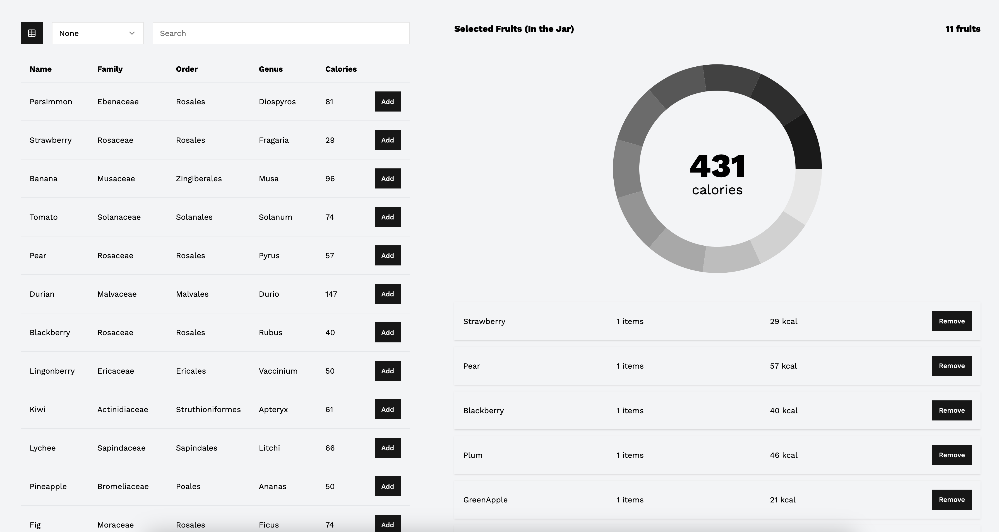

# Fruity Vice App



## Stack

- React
- Typescript
- React-Query
- Jotai
- Tailwind
- Shadcn

### Environment variables

In the root folder there is an example of an env file with all variables that should be filled for development.

| Environment Variables | Default value           |
| --------------------- | ----------------------- |
| `VITE_API_URL`        |                         |
| `VITE_NODE_ENV`       | development, production |

## Dependencies

- Node
- Docker

## Make Commands

Create container and run in dev mode

```
make dev
```

Create container and run in prod mode

```
make prod
```

Build a container

```
make build
```
